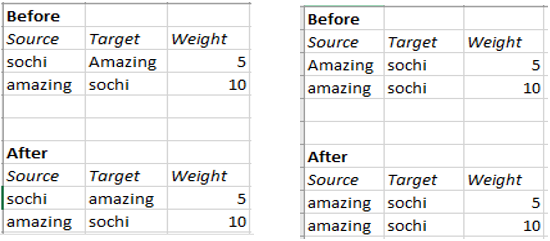
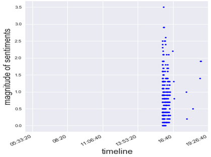
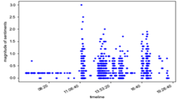
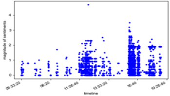
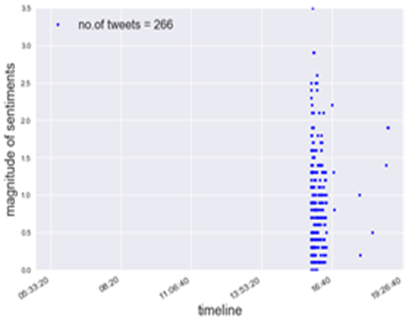
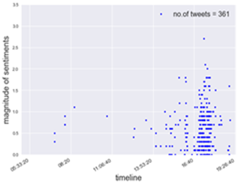
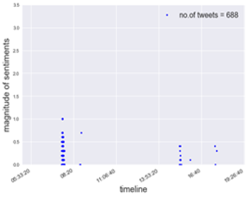
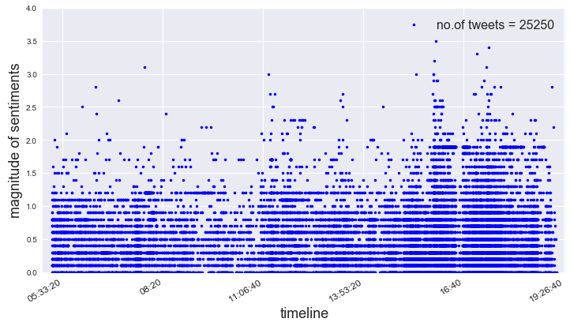
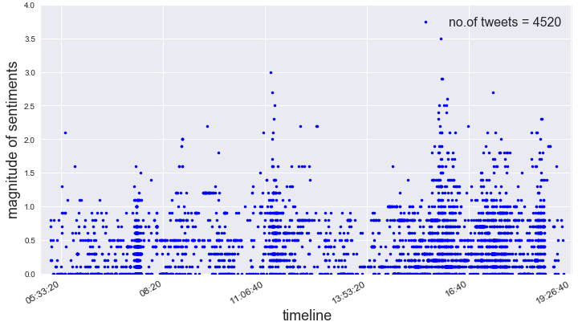

***Introduction*** :  We think of an "Event" as a big happening/occasion taking place in real world, since we will be using data set for Sochi Olympics 2014, in our case Sochi Olympics is an "Event". A "Sub-event" is what all happens inside the main event, so an example of "sub-event" will be an athlete winning a race in Olympics. In STRIM framework(https://journals.plos.org/plosone/article?id=10.1371/journal.pone.0187401), the user initially selects some keywords(hashtags) for which she wants to gather the tweets to identify the sub-events. Then the system generates three tweet streams using these keywords : Adaptive Stream is generated using adaptive keywords, Baseline Stream is generated by using user provided keywords, Extra Stream is just the difference of the adaptive and baseline streams. Once we have the streams we feed them into Burst Detection, which identifies the Peaks in tweets(which is increased number of tweets) related to the keywords(i.e. hashtags) the user mentioned (or the adapted keywords in case of adaptive stream). Peaks are the actual sub events, since there are increased number of tweets related to some hashtags(keywords).

In our research paper we try to implement similar functionality using sentiment analysis. We take the EX tweet stream, clean it and create a hashtag co-occurrence network, then we try to apply community detection such that each community could represent a sub-event. Similar to the STRIM framework, we could say that we have detected a sub-event if we detect a single peak in the sentiments of the tweets present in a single community.

***Creating hashtag co-occurrence network from the adjacency list***

We have used the Adjacency list provided to create the network. The adjacency list contains the list of edges and weights of those edges. We can use this file and the Gephi software to create a hashtag co-occurrence network. When we create the network, we see that several hashtags which should form one node (for example #Sochi and #sochi) are forming different nodes. This indicates the need of performing some form of pre-processing on the hashtags to make a network which is appropriate to do our further analysis. In this project we spent a lot of time on the pre-processing as it was a crucial step to create better network as all the analysis depends on the creation of the communities from the network.

The pre-processing steps that were applied on the adjacency list are as follows:

1.First we needed to reduce the dataset size, because it was too huge to do the pre-processing conveniently on our local machines. So, we kept only those rows in the data which had at least 10 co-occurrences. This strategy we have kept the same for all the three data sets for uniformity (AD, BL, EX).

2.**Spelling correction**: often while typing people can make spelling mistakes or add additional characters in a hashtag to put emphasis, so to deal with this we have performed spelling correction. We have applied this as the first step because later on we apply the word-splitting too and that actually chops the word badly if the spelling is not correct. Applying spelling correction after the word-splitting was not a good option because the splitted words are very difficult to be corrected by the spelling correction package that we are using. Also, the spelling correction package that was available performs very slow and so having less data is a good thing in this process.

3.**Translation**: when we plotted the data initially there were different language hashtags too. We decided to convert all the other languages to English so that we can make denser communities. For example, the hashtag #sochi can be written as #сочи in Russian, and thus forming 2 different nodes, which is undesirable since they mean the same thing and refer the tweets that contain data about the same event, so we would want these kinds of nodes to become the same node. Also, it is easier to inspect the network visually if everything is in one language which we understand.

4.**Word splitting**: In hashtags there is no spaces between words, therefore if we want to do any pre-processing like stop word removal or stemming, we first need to split the words. For example, the hashtags #sochi2014 and the hashtag #thesochi2014 would be mapped as separate nodes, but if we apply word splitting and then remove the stop word “the” these become the same node. Another possible difficulty that can arise is that sometimes this process splits the word badly, but at the end we will be combining all the words back without spaces so this problem does not completely destroy the words. Word splitting is performed by using a library called word ninja.

5.**Stemming**: First we thought of applying Lemmatization, but lemmatization requires context, that is a full sentence so that we can first perform part of speech tagging and then perform lemmatization. Since hashtags mostly contain just a few words we cannot perform lemmatization efficiently. Therefore, we use stemming instead. Stemming chops, the ending of the words so that we are left with what can be called the root of the words. For example, #walking, #walks, #walk all three get converted to #walk if we apply stemming. This also helps in creating denser communities.

6.**Stop word removal**: One of the reasons to do word splitting is to be able to remove the stop words. Stop words are the words like “the”, “is”, etc which don’t provide any information but can result in creating different nodes because of their presence. One possible disadvantage of performing stop word removal is that sometimes hashtags are made up of only stop words, and removing these will result in losing data completely about them. For example, there are hashtags #allin, which is made up of stop words and complete removal of this means we may miss out on some important trend. Therefore, to avoid data loss we have made the algorithm such that, if on removing the stop words there is nothing left in the hashtag, revert back the step and don’t perform stop word removal for this hashtag.

7.**Lower case**: keeping everything in the same case is necessary to avoid any difference between hashtags due to just case difference. For example, when we created the network without pre-processing, we were having two nodes #sochi and #Sochi which was undesirable.

8.**Joining the words back**: after doing all the pre-processing it can result in the creation of several words from the no space hashtag that we received. It is easier to handle hashtags if they are a single no space text, so we combine the processed words back into the no space version of the hashtags.

The pre-processing steps are not always accurate and can often introduce unwanted results, but since we are doing this just to make communities it won’t change the actual tweets and thus the sentiment of a tweet. Thus, applying this much pre-processing seems to have more benefit than loss.

After doing the pre-processing the resulting table can have two issues that we identified:

 

‘Before’ part shows that the rows are separate because of a small difference, but after pre-processing they become the same shown by the ‘After’ part,  and that's why we need to combine them. This was done in MySQL workbench using SQL queries.

Since in the beginning we reduced the adjacency list data to contain data with at least 10 co-occurrences, we also want to reduce the full data set (that contains the tweets), so that we have the data that corresponds to the co-occurring hashtags present in the adjacency list. This was done using SQL (in MySQL workbench) as this way is faster than doing it in python.

After the pre-processing of the adjacency lists, we need to pre-process the hashtags in the main data set as well. We are doing this because we will be retrieving the tweets from this full data set based on the hashtags in the adjacency list and since the hashtags in the adjacency list have been changed due to pre-processing, we need to pre-process the hashtags in the full data set as well.

Applying the pre-processing on the main data set is very slow, as there is a lot of data and is therefore a computationally very expensive process compared to the computing resources available at our disposal. To solve this issue, we came up with a method which does not require to pre-process the data again. For this we created a dictionary which has the old hashtags as the key and the processed hashtag as the value, now we iterate through the hashtags in the full data and match them with the keys in the dictionary and replace the old hashtag word in the full data set with the processed hashtag value from the dictionary. This greatly reduced hours of computing time and was completed within minutes.

Once we have the processed hashtags both in the adjacency list and the full data, we can proceed to create the network, apply the community detection algorithm and then retrieve the tweets corresponding to the co-occurring hashtags within a community. Once we retrieve the tweets for those set of co-occurring hashtags, we pre-process the tweets and apply sentiment analysis.

For pre-processing of the tweets, we first remove the hashtags symbol but maintain the word and then we have used the python package “tweet-pre-processor” on the tweets which removes the URLs, emojis, smileys, reserved words (RT, FAV) and mentions. We also customized the code to remove the colons as they were getting left behind even on applying the pre-processing and could create problems.

After the pre-processing of tweets, we use Google NLP API service (created on Google Cloud Platform) to calculate the sentiments of the tweets. This generates two numbers: sentiment score and sentiment magnitude. Sentiment score shows if the tweet is talking about something positive (if the score is positive) or negative (if the score is negative). The sentiment magnitude tells the intensity of the emotion. Since most of the events in the Olympics are competitions, for any event there would be one winner and one loser and so there will be mixed sentiment tweets for any sub-event, and showing the intensity of the sentiments wouldn’t be easy in a scatter plot. So, the easiest and more efficient thing would be to plot the sentiment magnitude. So, for every community we plot the sentiment magnitude.

**Data for Analysis:** Since the EX stream contains the extra data captured by the Adaptive crawler in the STRIM framework. It is more sensible to apply sentiment analysis for sub-event detection on this data. Also, the Adaptive stream and Baseline Stream have too much data and required more processing power and time to be analysed, therefore we decide to do the analysis on just the EX stream data. In the analysis, if the communities that we have created have been successful in gathering together the tweets relating to a subevent we would be able to see some clustering if we plot the sentiment magnitude of the tweets on time line.

*The tweets of a particular sub-event should show clustered together around the time of actual occurrence of the sub-event. Also there should be some spike in sentiment because of the occurrence of the subevent.*

For example, a sub-event should ideally look like the adjacent image, where we can see a very distinct clustering of the tweets according to time, and also the high sentiment magnitude shows that something significant has happened.

These tweets actually correspond to the sub-event “Anton Shinpulin led the Russian team to win the biathlon relay”. Below we will be showing the results of two methods that we applied to do this sentiment analysis for detecting the sub-events. One problem that we see while doing this is that there are some sub-events which share a lot of hashtags and thus get clustered into the same community. We will try to tackle this problem in the two methods that we discuss.

**Assumptions:** Some important assumptions we will follow are : when a sub-event occurs there will be peak in the tweets having hashtags relevant to the tweet and the sentiments of these tweets will be high, and these tweets will be occurring in a short span of time. Following this assumption, a good community will be the one having tweets relating to only a single sub-event which would show up as a single peak of tweets clustered together in the sentiment magnitude vs time plots.

**Sentiment analysis on the detected communities of the EX stream**

In this method we first apply the community detection on the network and check what communities get created.

In the Gephi the default resolution for Modularity is 1.0 and on applying this setting (with “randomize” and “use weights” check box ticked) we get around 15 communities. But on inspecting the communities we find that there are very few communities that contain a huge portion of the nodes, for example there is one huge community that constitutes around 26.01% of the nodes. Since we know that there are several sub-events that we want to detect, having so many nodes in just a single community will contain nodes from different sub-events as well.

Due to this we will not be able to detect sub-events.

To tackle this situation, we decreased the value of Resolution so that we get more communities such that even the largest community has a comparable number of nodes.

Keeping resolution 0.7 we get 12 communities which have a significant number of nodes (the communities which had extremely smaller number of nodes were ignored).

 The problem with doing this kind of community detection and sentiment analysis for sub-event detection is that there are several hashtags which are common between sub-events and due to this the degree of these hashtags increases and it pulls the communities of two different sub-events together into a single community.

This can be seen from the plots as well where we see some amount of clustering around several specific points in time.

Below are some of the images showing the problem of multiple sub-events in the same community(as we can see multiple clustering along time or very spread out tweets along time):

**Sub event detection using sentiment analysis by applying community detection twice to get what we are calling sub-community (on EX stream)**

The main problem with the approach we saw above was the high-degree-generic nodes which could occur across sub events and therefore bring all the nodes from different sub events together into the same community.

To tackle this problem, we first apply the community detection at resolution 1, then inside each community we **delete** the highest degree nodes which were very generic to belong to just one sub event. Then we apply the community detection again. This time the communities that we get have better clarity, that is they belong to tweets that occurred in a short time span, and have high sentiment magnitude.

Since we are using a scatter plot which cannot show overlapping points visually distinguishable, and there can be a number of Re-Tweets which will all have the same magnitude. Therefore to indicate the number of tweets in a plot we have mentioned the number of tweets in the sub-community plots at the top right corner of the plot.

As in this method each sub-community will be relatively quite small in size, the number of tweets in each sub-community is also quite low.

We observe that we get some improvement, but even this method is not perfect, and often multiple peaks can be seen. This might be improved by adopting a better strategy to remove the high-degree-nodes.

 Another thing we observe that the number of tweets per sub-community becomes very low in this method.

**Conclusion**: We saw that applying community detection on the EX network could be a possible method to detect the sub-events, but the main problem that we face in this method is the hashtags that are common between sub-events and high in degree (as they are present in more than one sub-events) which bring together two or more sub-event hashtags into the same community. We explored this idea further by manually deleting some high-degree-nodes in each community and again applying community detection to get sub-communities, and we were able to see an increased quality in the formation of communities that mostly contain only a single sub-event. One drawback of this approach is that the sub-community size becomes very small.

**Further Work:** The method we suggested is still just an experiment and need to be further evaluated to come up with a systematic algorithm to remove high-degree-generic nodes without user intervention and evaluate how good accuracy can be achieved in detecting sub-events.

Improving the Network further can also help in improving the community detection.

The tweet cleaning package we used has several drawbacks and better cleaning of tweet data can also help in improving the accuracy of the sentiment analysis.

​							***Fig : Plot shows all the tweets present in EX stream and their sentiment magnitudes***

***Fig : Plot showing some clustering in the tweets belonging since they belong to some of the major sub-communities in the network, tweets belonging to smaller sub-communities were deleted***
